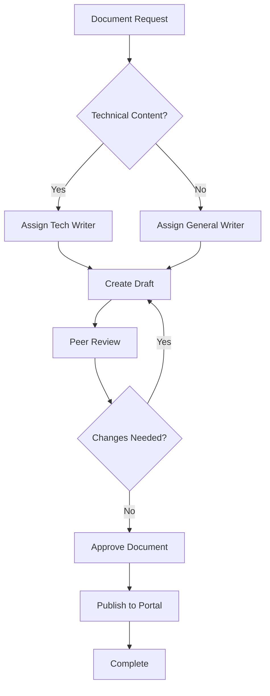
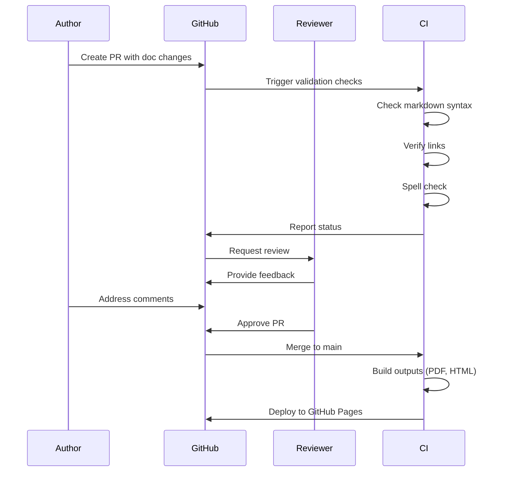
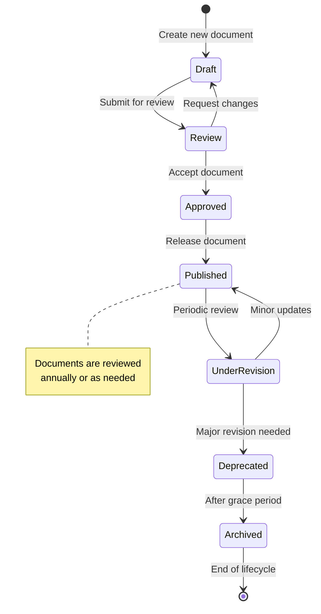
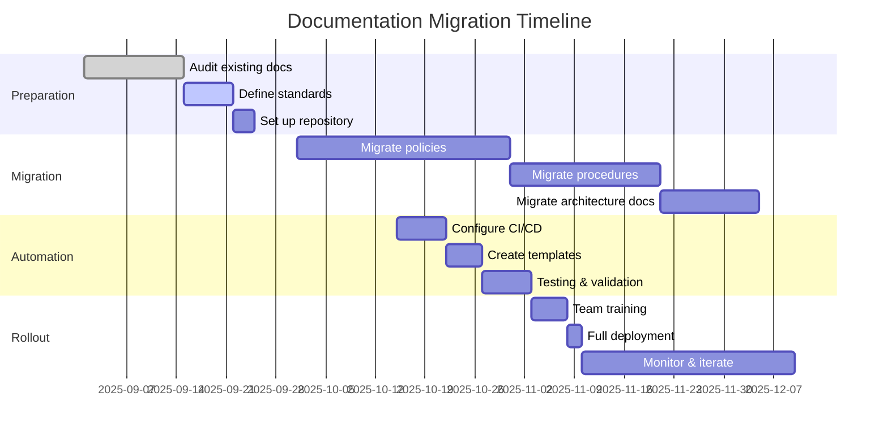
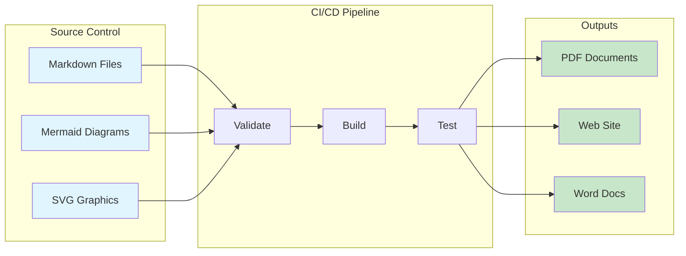
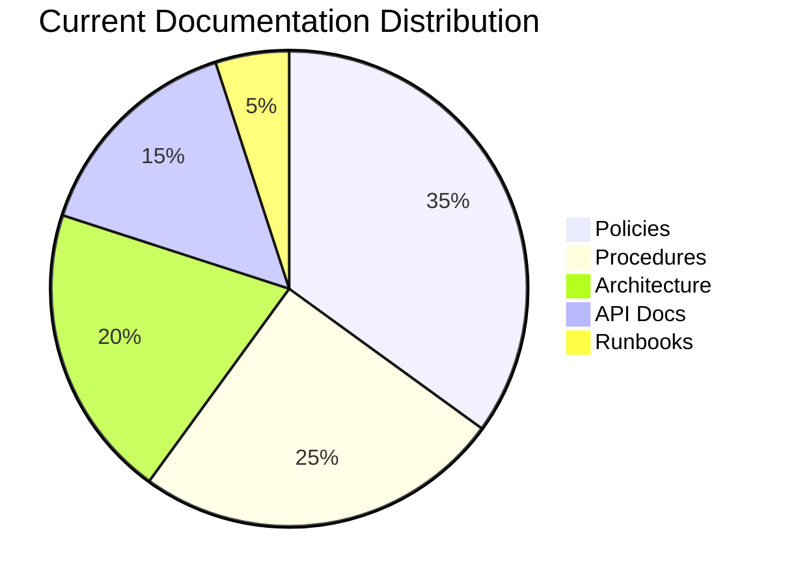
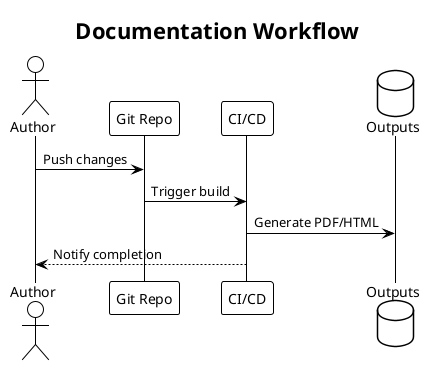
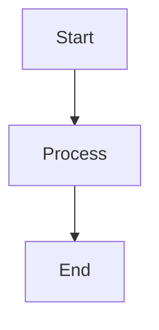

# Docs-as-Code Strategy

> **Note:** This document should be placed in `.github/DOCUMENTATION/docs-as-code-strategy.md` in your documentation repository, alongside the [Repository Setup Guide](./setup-guide.md). Together, these form the meta-documentation that explains how to use and maintain the documentation system.

## Overview

This document outlines our approach to managing documentation using docs-as-code principles. We treat documentation with the same rigor as source code: version controlled, peer reviewed, tested, and automatically deployed.

## Core Principles

### Primary Technologies
- **Source Format**: Markdown (.md files)
- **Version Control**: Git/GitHub
- **Visual Elements**: Mermaid diagrams (preferred), minimal binary assets
- **Output Formats**: PDF, DOCX, HTML (generated via CI/CD)

### Key Benefits
- Single source of truth for all documentation
- Full version history and attribution
- Peer review via pull requests
- Automated quality checks and deployment
- Plain text searchability and portability
- No vendor lock-in

## Repository Structure

```
.github/
├── DOCUMENTATION/            # Meta-documentation (about the repo itself)
│   ├── README.md           # Index of meta-docs
│   ├── setup-guide.md      # Repository setup and structure guide
│   └── docs-as-code-strategy.md  # This document
├── workflows/              # GitHub Actions for CI/CD
├── ISSUE_TEMPLATE/        # Issue templates
└── PULL_REQUEST_TEMPLATE/ # PR templates

docs/
├── README.md                 # Documentation index
├── policies/                 # Policy documents
│   ├── security-policy.md
│   ├── data-retention.md
│   └── assets/              # Policy-specific assets
├── procedures/              # Standard operating procedures
│   ├── incident-response.md
│   └── onboarding.md
├── architecture/            # Technical architecture docs
│   ├── system-overview.md
│   └── api-design.md
├── templates/               # Reusable templates
│   └── policy-template.md
└── assets/                  # Shared assets
    ├── images/             # Binary images (when unavoidable)
    └── exports/            # Generated files (gitignored)
```

### Meta-Documentation Placement

This document and the repository setup guide are **meta-documentation** - they explain how to use the documentation system itself. They live in `.github/DOCUMENTATION/` to:

- Keep them separate from actual documentation content
- Make them discoverable (GitHub renders `.github` folders nicely)
- Follow developer conventions (configuration in `.github`)
- Ensure they're included in every documentation repository

## Visual Content Strategy

### Hierarchy of Preference

1. **Mermaid Diagrams** (90% of use cases)
   - Flowcharts, sequence diagrams, state diagrams
   - Version controlled as text
   - Renders automatically on GitHub

2. **SVG Graphics** (8% of use cases)
   - Complex diagrams requiring precise control
   - Created in draw.io/Excalidraw, exported as SVG
   - Store source files (.drawio/.excalidraw) in repo

3. **Binary Images** (2% of use cases)
   - Screenshots (only when absolutely necessary)
   - Photos or external graphics
   - Use Git LFS for files >1MB

## Mermaid Diagram Examples

### Flowchart - Decision Process



### Sequence Diagram - PR Review Process



### State Diagram - Document Lifecycle



### Gantt Chart - Documentation Roadmap



### Architecture Diagram - Build Pipeline



### Pie Chart - Documentation Types



## Alternative Diagram Tools

### PlantUML Example

While Mermaid is our preferred tool, PlantUML offers additional diagram types:



## Writing Guidelines

### Markdown Standards

1. **Use ATX-style headers** (`#` not underlines)
2. **One sentence per line** (improves diff readability)
3. **Reference links at bottom** for cleaner source
4. **Semantic line breaks** at logical boundaries

Example:
```markdown
# Policy Title

## Overview

This policy establishes guidelines for secure handling of customer data.
It applies to all employees and contractors with access to production systems.

## Scope

The policy covers:
- Data classification standards
- Storage requirements  
- Access controls
- Retention periods

## Procedures

### Data Classification

All data must be classified according to sensitivity level.
Classification determines required security controls.

[See data classification matrix][classification-matrix] for details.

[classification-matrix]: ./appendix/data-classification.md
```

### Mermaid Best Practices

1. **Keep diagrams focused** - One concept per diagram
2. **Use descriptive labels** - Clear, concise node text
3. **Consistent direction** - TB (top-bottom) or LR (left-right)
4. **Add notes sparingly** - Only for critical clarifications
5. **Test rendering** - Verify on GitHub before merging

## Build Pipeline

### GitHub Actions Workflow

```yaml
name: Documentation Build

on:
  push:
    branches: [main]
  pull_request:
    branches: [main]

jobs:
  validate:
    runs-on: ubuntu-latest
    steps:
      - uses: actions/checkout@v4
      
      - name: Setup Node.js
        uses: actions/setup-node@v4
        with:
          node-version: '20'
          cache: 'npm'
      
      - name: Validate Markdown
        uses: DavidAnson/markdownlint-cli2-action@v11
        
      - name: Check Links
        uses: lycheeverse/lychee-action@v1
        
      - name: Spell Check
        uses: streetsidesoftware/cspell-action@v2

  build:
    needs: validate
    runs-on: ubuntu-latest
    steps:
      - uses: actions/checkout@v4
      
      - name: Setup Node.js
        uses: actions/setup-node@v4
        with:
          node-version: '20'
          cache: 'npm'
          
      - name: Install mermaid-cli
        run: npm install -g @mermaid-js/mermaid-cli
        
      - name: Generate PDFs
        run: |
          for file in docs/**/*.md; do
            pandoc "$file" \
              --pdf-engine=xelatex \
              --filter=mermaid-filter \
              -o "${file%.md}.pdf"
          done
          
      - name: Generate DOCX
        run: |
          for file in docs/**/*.md; do
            pandoc "$file" \
              --filter=mermaid-filter \
              -o "${file%.md}.docx"
          done
          
      - name: Upload artifacts
        uses: actions/upload-artifact@v4
        with:
          name: generated-docs
          path: |
            docs/**/*.pdf
            docs/**/*.docx
```

## Asset Management

### When Binary Images Are Necessary

If you must include screenshots or photos:

1. **Optimize before committing**
   ```bash
   # For PNGs
   optipng -o7 screenshot.png
   
   # For JPEGs
   jpegoptim --max=85 photo.jpg
   ```

2. **Use semantic naming**
   ```
   dashboard-user-view-2025-09-23.png
   network-topology-v2.svg
   ```

3. **Configure Git LFS** for large files
   ```bash
   # Initialize Git LFS
   git lfs install
   
   # Track common binary formats
   git lfs track "*.png" "*.jpg" "*.jpeg" "*.gif"
   git lfs track "*.pdf" "*.docx" "*.xlsx" "*.pptx"
   git lfs track "*.zip" "*.tar.gz" "*.dmg" "*.exe"
   
   # Commit the .gitattributes file
   git add .gitattributes
   git commit -m "Configure Git LFS tracking"
   ```

4. **Include alt text** for accessibility
   ```markdown
   
   ```

## Tools and Setup

### Essential Tools

- **VS Code Extensions**:
  - Markdown All in One
  - Markdown Preview Mermaid Support
  - markdownlint
  - Code Spell Checker

- **Command Line Tools**:
  - `pandoc` - Document conversion
  - `mermaid-cli` - Diagram rendering
  - `markdownlint-cli2` - Linting
  - `git-lfs` - Large file storage

### Alternative Modern Documentation Frameworks

#### Astro Starlight
- Modern docs framework, faster than MkDocs
- Built-in dark mode, search, i18n
- Better performance than MkDocs Material
- Native MDX support for interactive content

#### Docusaurus 3
- React-based, excellent for technical docs
- Built-in versioning support
- Strong MDX support for interactive content
- Large ecosystem of plugins

### Local Development Setup

```bash
# Clone repository
git clone https://github.com/org/documentation.git
cd documentation

# Install dependencies
npm install

# Validate markdown
npm run lint

# Build all outputs
npm run build

# Serve HTML locally
npm run serve
```

## Obsidian for Non-Technical Contributors

### Overview

Obsidian provides a user-friendly, visual way for non-technical team members to contribute to documentation while maintaining our Markdown-based workflow. It combines the simplicity of a note-taking app with powerful features for managing a documentation repository.

### Why Obsidian Works Well

- **WYSIWYG-like editing** - See formatted text while editing Markdown
- **Live preview** - Instant rendering of Mermaid diagrams
- **File explorer** - Visual navigation of the docs structure
- **No command line needed** - Everything through a graphical interface
- **Git integration** - Push/pull changes without terminal commands
- **Free for personal use** - No licensing costs for contributors

### Initial Setup for Non-Technical Users

#### Step 1: Install Obsidian
1. Download Obsidian from [obsidian.md](https://obsidian.md)
2. Install and launch the application
3. Choose "Open folder as vault"
4. Select your cloned documentation repository folder

#### Step 2: Configure for Documentation Work
1. Go to Settings (gear icon)
2. Under "Editor":
   - Turn ON "Strict line breaks" (ensures GitHub compatibility)
   - Turn ON "Show frontmatter" (for document metadata)
3. Under "Files & Links":
   - Set "Default location for new notes" to appropriate docs subfolder
   - Turn OFF "Use [[Wikilinks]]" (use standard Markdown links)
   - Set "New link format" to "Relative path to file"

#### Step 3: Install Essential Plugins

Navigate to Settings → Community Plugins → Browse:

1. **Git** by Denis Olehov
   - Enables version control without command line
   - Provides visual interface for commits and syncing
   
2. **Mermaid Tools** 
   - Provides toolbar for creating diagrams
   - Live preview of Mermaid diagrams
   
3. **Linter**
   - Ensures consistent Markdown formatting
   - Auto-fixes common issues

4. **Markdown Table Editor**
   - Visual table editing without memorizing syntax

### Using the Git Plugin

#### Initial Git Configuration

After installing the Git plugin:

1. Open Command Palette (Ctrl/Cmd + P)
2. Type "Git: Clone an existing repository"
3. Enter repository URL
4. Choose local folder

Or if you already have the repository:
1. Open the repository folder as vault
2. Git plugin will automatically detect it

#### Authentication Setup for Git Plugin

**For GitHub:**
1. Create a Personal Access Token:
   - Go to GitHub Settings → Developer Settings → Personal Access Tokens
   - Generate new token (classic) with 'repo' scope
   - Copy the token

2. Configure in Obsidian Git plugin:
   - Settings → Community Plugins → Git → Authentication/Hosting service
   - Select GitHub
   - Paste your Personal Access Token
   - Username: your GitHub username
   - Test with Pull command

**Troubleshooting Authentication:**
- If you get "authentication failed" errors, regenerate your token
- Ensure the token has 'repo' scope for private repositories
- For organizations, ensure SSO is authorized for the token

#### Daily Workflow

The Git plugin adds a source control panel (clock icon in left sidebar):

**Starting Work:**
1. Click "Pull" button (down arrow) to get latest changes
2. Review any updates from team members

**Making Changes:**
1. Edit documents normally in Obsidian
2. Changes appear in the source control panel
3. Review changes in the diff view

**Saving Work:**
1. Click the checkmark to stage changes
2. Write a commit message describing your changes
   - Example: "Update security policy with new password requirements"
3. Click "Commit" button
4. Click "Push" button (up arrow) to share with team

**Handling Conflicts:**
- If conflicts occur, the plugin highlights them
- Contact technical team member for assistance
- Or use the visual merge tool to resolve

### Obsidian Editing Tips

#### Creating Mermaid Diagrams

Use fence blocks with "mermaid" identifier:
````

````

The diagram renders immediately in preview mode.

#### Using Templates

1. Create templates in `docs/templates/` folder
2. Use Templates plugin to insert quickly
3. Hotkey: Ctrl/Cmd + T to insert template

#### Working with Images

1. Paste images directly into Obsidian
2. They're automatically saved to designated folder
3. Links are created automatically
4. Remember: prefer Mermaid diagrams over static images

#### Live Collaboration Features

- **Linked mentions** - See all documents that reference the current file
- **Graph view** - Visualize documentation relationships
- **Quick switcher** - Ctrl/Cmd + O to jump between files
- **Global search** - Ctrl/Cmd + Shift + F to find content

### Best Practices for Non-Technical Contributors

1. **Always pull before starting work**
   - Prevents conflicts with others' changes
   
2. **Commit frequently with clear messages**
   - "Fixed typo in security policy" ✓
   - "Updates" ✗

3. **Preview before committing**
   - Use preview mode (Ctrl/Cmd + E) to check formatting
   - Verify Mermaid diagrams render correctly

4. **Use the staging area**
   - Review changes before committing
   - Unstage accidental changes

5. **Ask for help when needed**
   - Red markers usually indicate conflicts
   - Technical team can assist with complex merges

### Troubleshooting Common Issues

**"Failed to push" error**
- Someone else has pushed changes
- Click "Pull" first, then push again

**Mermaid diagram not rendering**
- Check for syntax errors (red highlighting)
- Use the Mermaid Tools plugin helper

**Can't see Git panel**
- Enable plugin in Community Plugins
- Restart Obsidian
- Check if in a git repository (look for .git folder)

**Formatting looks different on GitHub**
- Ensure "Strict line breaks" is enabled
- Use preview mode to verify
- Check that Wikilinks are disabled

### Video Tutorials and Resources

Recommended learning path:
1. [Obsidian Basics](https://obsidian.md/learn) (30 min)
2. [Git Plugin Tutorial](https://github.com/denolehov/obsidian-git/wiki) (20 min)
3. Internal training session recording (1 hour)
4. Practice in the sandbox repository first

### Support Channels

- **Documentation team Slack**: #docs-help
- **Weekly office hours**: Thursdays 2-3 PM
- **Obsidian community forum**: For app-specific questions
- **Internal wiki**: Obsidian tips and tricks page

## AI-Assisted Documentation

### Using AI for Documentation

AI tools like Claude, ChatGPT, and GitHub Copilot can significantly accelerate documentation creation while maintaining quality.

#### Appropriate Use Cases
- **First drafts** - Generate initial content structure
- **Code documentation** - Extract docstrings and create API docs
- **Style consistency** - Reformat existing content
- **Translation** - Create multilingual documentation
- **Summaries** - Condense lengthy technical content

#### Guidelines for AI-Generated Content

1. **Always review and verify** - AI can make factual errors
2. **Maintain voice consistency** - Edit to match team style
3. **Fact-check technical details** - Verify commands, APIs, versions
4. **Add human expertise** - Include real-world examples and edge cases
5. **Attribute appropriately** - Note if content is AI-assisted when required

#### Prompt Templates

**For Policy Documents:**
```
Create a draft policy document for [topic] that includes:
- Purpose and scope
- Definitions
- Policy statements
- Responsibilities
- Compliance requirements
- Related documents

Use formal language appropriate for corporate documentation.
```

**For Technical Guides:**
```
Write a technical guide for [task] aimed at [audience].
Include:
- Prerequisites
- Step-by-step instructions
- Code examples
- Common errors and troubleshooting
- Best practices

Use clear, concise technical language.
```

**For API Documentation:**
```
Document this API endpoint:
[paste code/spec]

Include:
- Description
- Parameters (type, required, description)
- Request/response examples
- Error codes
- Rate limits
- Authentication requirements
```

## Migration Checklist

When converting existing documentation to this template-based repository (see also: [Repository Setup Guide](./.github/DOCUMENTATION/setup-guide.md)):

- [ ] Create repository from template (meta-documentation included automatically)
- [ ] Wait for automatic initialization to complete
- [ ] Export source content from existing systems to plain text
- [ ] Convert content to Markdown format
- [ ] Replace static diagrams with Mermaid where possible
- [ ] Extract and optimize necessary images (configure Git LFS if needed)
- [ ] Add front matter metadata to documents
- [ ] Organize content into appropriate template directories
- [ ] Validate all internal links
- [ ] Test output generation (PDF/DOCX) using included workflows
- [ ] Peer review via pull request
- [ ] Update navigation and index files
- [ ] Set up redirects from old documentation locations
- [ ] Archive legacy version
- [ ] Notify stakeholders of new location

## FAQs

### Q: Where do I find instructions for setting up a new documentation repository?

Check the meta-documentation in `.github/DOCUMENTATION/`:
- **[setup-guide.md](./.github/DOCUMENTATION/setup-guide.md)** - Complete repository setup instructions
- **[docs-as-code-strategy.md](./.github/DOCUMENTATION/docs-as-code-strategy.md)** - This document, explaining the philosophy

These files should be included in every documentation repository to make it self-contained.

### Q: What if Mermaid can't create the diagram I need?

First, challenge whether the diagram is truly that complex. Often, breaking it into multiple simpler diagrams improves clarity. If genuinely needed, use draw.io or Excalidraw and export as SVG, keeping the source file in the repo. Consider PlantUML for specialized diagram types.

### Q: How do we handle confidential information?

Use a private repository with appropriate access controls. Consider using git-crypt for an additional encryption layer on sensitive files. Never commit secrets or credentials, even in private repos.

### Q: What about rich formatting (colors, fonts, etc.)?

Markdown intentionally limits formatting options to maintain consistency and simplicity. For output formatting, use CSS for HTML and LaTeX templates for PDF generation. The source should focus on content, not presentation.

### Q: Can non-technical staff contribute?

Yes! We recommend Obsidian with the Git plugin for non-technical contributors - see the [Obsidian for Non-Technical Contributors](#obsidian-for-non-technical-contributors) section above for detailed setup instructions. Alternatively, GitHub's web interface allows direct editing with preview, and tools like Typora provide WYSIWYG-like editing.

### Q: Should we use AI to help write documentation?

AI tools can be valuable for creating first drafts and maintaining consistency. However, all AI-generated content must be reviewed, verified, and edited by a human before committing. See the [AI-Assisted Documentation](#ai-assisted-documentation) section for guidelines.

### Q: How do we handle versioning for product documentation?

For product docs that need versioning, consider using tools like Docusaurus or MkDocs with the mike versioning plugin. Alternatively, use Git tags and branches to maintain different versions.

## References

- [Mermaid Documentation](https://mermaid.js.org/intro/)
- [GitHub Flavored Markdown Spec](https://github.github.com/gfm/)
- [Pandoc User's Guide](https://pandoc.org/MANUAL.html)
- [Write the Docs - Documentation Guide](https://www.writethedocs.org/guide/)
- [The Documentation System](https://documentation.divio.com/)
- [PlantUML Guide](https://plantuml.com/guide)

---

*Last Updated: 2025-09-24*  
*Version: 1.2.0*  
*Owner: Documentation Team*