# 📚 Docs-as-Code Template

> **Production-ready documentation system with GitHub Actions, automated testing, and modern tooling**

[](https://github.com/cto4ai/docs-as-code-template/generate)
[](LICENSE.md)
[](https://www.writethedocs.org/guide/docs-as-code/)

This template provides everything you need to implement professional docs-as-code practices in your organization. Get a fully configured documentation repository in under 5 minutes with automated testing, multi-format publishing, and modern tooling.

## ✨ What You Get

When you use this template, you'll receive a **fully functional documentation repository** with:

### 🔄 **Automatic Setup** (2-3 minutes)
- **Personalized content** with your repository and organization information
- **Dependencies installed** and ready to use
- **GitHub Actions configured** for validation and publishing
- **Example content removed** and clean structure ready for your docs
- **Setup issue created** with personalized next steps

### 📁 **Complete Structure**
```
your-new-docs-repo/
├── docs/
│   ├── policies/          # Policy documents
│   ├── procedures/        # SOPs and runbooks
│   ├── architecture/      # Technical documentation
│   └── templates/         # Reusable document templates
├── .github/
│   ├── workflows/         # CI/CD for validation & publishing
│   └── DOCUMENTATION/     # Meta-docs about the system
└── scripts/               # Utility scripts for maintenance
```

### 🚀 **Production Features**
- **Markdown validation** with markdownlint
- **Spell checking** with cspell
- **Link validation** to prevent broken links
- **Mermaid diagrams** for flowcharts and architecture
- **PDF generation** for stakeholder sharing
- **Multi-format publishing** (HTML, PDF, DOCX)
- **Git LFS** pre-configured for binary assets

## 🎯 Quick Start

### 1. Create Your Repository
[](https://github.com/cto4ai/docs-as-code-template/generate)

1. Click **"Use this template"** above
2. Name your repository (e.g., `my-org-docs`, `product-documentation`)
3. Choose public or private
4. Click **"Create repository"**

### 2. Automatic Initialization
GitHub Actions will automatically:
- ✅ Replace template variables with your repository information
- ✅ Install dependencies and configure tools
- ✅ Remove example content and template files
- ✅ Create a setup issue with your personalized next steps

### 3. Start Documenting
Within minutes, you'll have a working documentation system ready for:
- Writing policies, procedures, and technical docs
- Collaborative review via pull requests
- Automated validation and publishing
- Professional documentation workflows

## 📋 What Gets Automated

| Feature | Template State | Your Repository |
|---------|---------------|-----------------|
| Repository name | `{{REPO_NAME}}` | `your-repo-name` |
| Organization | `{{GITHUB_ORG}}` | `your-github-org` |
| Company name | `{{COMPANY_NAME}}` | Auto-generated from repo name |
| Contact info | Placeholders | Default values (customizable) |
| Dependencies | Listed | Installed and ready |
| Validation | Configured | Working immediately |

## 🛠️ Included Tools

- **[markdownlint](https://github.com/DavidAnson/markdownlint)**: Consistent markdown formatting
- **[cspell](https://cspell.org/)**: Spell checking with technical dictionaries
- **[markdown-link-check](https://github.com/tcort/markdown-link-check)**: Validate all links
- **[mermaid](https://mermaid.js.org/)**: Diagrams as code
- **[pandoc](https://pandoc.org/)**: Multi-format document conversion
- **GitHub Actions**: Automated testing and deployment

## 📖 Documentation Philosophy

This template implements **docs-as-code** principles:

- 📝 **Documentation in version control** alongside source code
- 🔍 **Peer review** via pull requests
- 🤖 **Automated testing** to catch errors early
- 🚀 **Continuous deployment** of updates
- 📊 **Analytics and metrics** on documentation health
- 🎯 **Single source of truth** for all organizational knowledge

## 🏗️ Architecture

```mermaid
graph LR
    A[Write Docs] --> B[Create PR]
    B --> C{Automated Tests}
    C -->|✅ Pass| D[Peer Review]
    C -->|❌ Fail| E[Fix Issues]
    E --> B
    D --> F[Merge & Deploy]
    F --> G[Published Docs]

    style C fill:#e1f5fe
    style F fill:#c8e6c9
    style G fill:#c8e6c9
```



## 🎯 Use Cases

Perfect for organizations that need:

- **Policy documentation** with approval workflows
- **Technical documentation** with diagram support
- **API documentation** with automated testing
- **Runbooks and procedures** with version control
- **Knowledge bases** with collaborative editing
- **Multi-team documentation** with access controls

## 🤝 Contributing & Support

- **Issues**: [Report bugs or request features](https://github.com/cto4ai/docs-as-code-template/issues)
- **Discussions**: [Community support and ideas](https://github.com/cto4ai/docs-as-code-template/discussions)
- **Documentation**: See [setup guide](.github/DOCUMENTATION/setup-guide.md) and [strategy doc](.github/DOCUMENTATION/docs-as-code-strategy.md)

## 📄 License

This template is provided under the [MIT License](LICENSE.md). You may choose any license for your documentation repository.

---

**Ready to implement professional documentation practices?**
[**Use this template →**](https://github.com/cto4ai/docs-as-code-template/generate)

*Built with ❤️ for the docs-as-code community*
