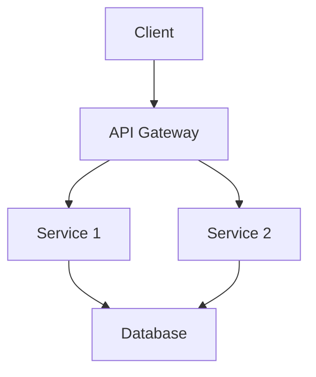
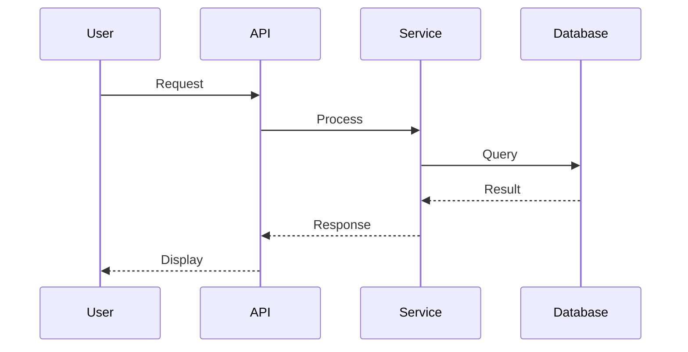

# System/Component Name Architecture

## Executive Summary
[2-3 sentence overview of the system/component]

## Context and Goals

### Business Context
[Why does this system exist? What business problem does it solve?]

### Technical Goals
- Goal 1
- Goal 2
- Goal 3

### Non-Goals
[What this system explicitly does NOT do]

## High-Level Design

### System Overview

### Key Components

#### Component 1
- **Purpose**: [What it does]
- **Technology**: [Tech stack]
- **Responsibilities**: [Key responsibilities]

#### Component 2
- **Purpose**: [What it does]
- **Technology**: [Tech stack]
- **Responsibilities**: [Key responsibilities]

## Detailed Design

### Data Flow

### API Design
[Description of API patterns, standards, authentication]

### Data Model
[Key entities and relationships]

### Security Architecture
- Authentication method
- Authorization approach
- Data encryption
- Security boundaries

## Technology Choices

| Component | Technology | Rationale |
|-----------|-----------|-----------|
| [Component] | [Tech choice] | [Why this technology] |

## Operational Considerations

### Scalability
[How the system scales]

### Reliability
[Failure modes and recovery]

### Monitoring
[What metrics are tracked]

### Deployment
[Deployment strategy and environments]

## Alternatives Considered
[Other approaches that were evaluated and why they were rejected]

## Future Considerations
[Potential future enhancements or changes]

## References
- [Link to related documentation]
- [Link to ADRs]
- [Link to runbooks]

---
*Last Updated: YYYY-MM-DD*  
*Authors: [Names]*  
*Status: [Draft/Review/Approved]*
